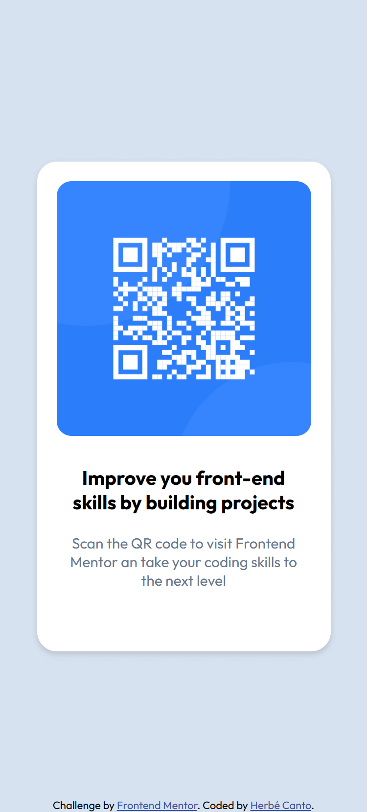

# Frontend Mentor - QR code component solution

This is a solution to the [QR code component challenge on Frontend Mentor](https://www.frontendmentor.io/challenges/qr-code-component-iux_sIO_H). Frontend Mentor challenges help you improve your coding skills by building realistic projects.

## Table of contents

- [Overview](#overview)
  - [Screenshot](#screenshot)
  - [Links](#links)
- [My process](#my-process)
  - [Built with](#built-with)
  - [What I learned](#what-i-learned)
  - [Continued development](#continued-development)
- [Author](#author)

## Overview

### Screenshot



### Links

- Solution URL: [My solution](https://github.com/herbecanto/QR-Code-Component.git)
- Live Site URL: [My page for my solution](https://herbecanto.github.io/QR-Code-Component)

## My process

### Built with

- Semantic HTML5 markup
- CSS
- Flexbox

### What I learned

I learned about how to best position the QR sign, as well as a little bit of flexbox.
In the css part, i learned how to put the footer in the botom:

```css
footer {
  position: absolute;
  bottom: 0;
  width: 100%;
  display: flex;
  justify-content: center;
}
```

and i learn that i need to put all the font weight in my link that i need to put in my style.

```html
<link
  href="https://fonts.googleapis.com/css2?family=Outfit:wght@300;400;700&display=swap"
  rel="stylesheet"
/>
```

### Continued development

I want to learn more about web design, especially with JavaScript, and, on the other hand, perfect my knowledge with flexbox and grid.

## Author

- Website - [Herbé Canto (in construction...)](https://herbecanto.github.io/)
- Frontend Mentor - [@herbecanto](https://www.frontendmentor.io/profile/herbecanto)
